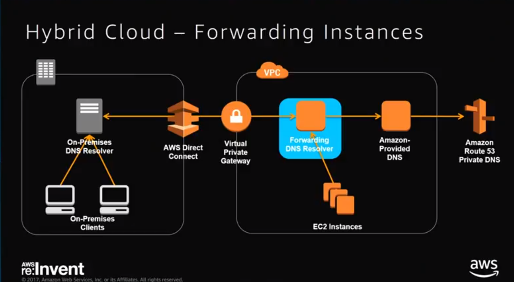

# Cloud Computing: DNS Dienst Route 53

## Grundlagen DNS

### DNS Funktionsweise

- TTL:
  - Wie lange eine vom DNS gegebene Routinginformation als aktuell gilt
  - Wie schnell soll die Welt eine Änderung mitbekommen
  - Kurze TTL:
    - Schnelle umlagerung von Traffic
    - Gives you the Responsiveness to act
    - Z.B. Bei Weighted Round Robin und Health Check, da man hierfür das Routing schnell beeinflussen/ändern möchte. Einen "Bad Endpoint" schnell außer kraft setzten
  - Lange TTL:
    - Weniger hohe kosten
    - Bessere Customer experience da jedes mal Latzenz für DNS Lookup wegfällt
    - Es wird noch mit dem "local cashing resolver" geredet und von dort erhält man direkt auskunft
    - Verringert Query-Volume also weniger Kosten für den Service
  - Also für kritische Änderungen -> Niedrige TTL um bei Problemen schnell einen Rollback durchzuführen.
    - Hätte man eine TTL von 2h wäre das ein großes Problem
    - Als Best Practice:
      - Zunächst die TTL niedrig setzten.
      - Dann warten
      - Dann Änderungen durchführen ebenfalls mit niedriger TTL
      - Etwas Zeit geben um Änderungen und ggf Probleme zu verfolgen
      - TTL höher setzten

### Vorteile von DNS
[link](https://stratusly.com/best-dns-hosting-cloudflare-dns-vs-dyn-vs-route-53-vs-dns-made-easy-vs-google-cloud-dns/)
- Geschwindigkeit
- Sicherheit
- Redundanz (kein single point of failure)
-

## Route 53
- Verschiedene Routing Policies Arten
  - Simple (Round Robin?)
  - Latenz
    - User wird immer zur nähesten Location geroutet
  - Failover
  - Geolocation
    - Eu nach Euro, USA nach Dollar usw
    - Leute aus land xyz müssen diesen Server nutzen
  -
- Health Check
  - Monitoring von Webservern

- Domain Name Registrierung

- Trafic Flow

- API und Commandline Tools -> Einfach zu automatisieren in großen Projekten
- 100% SLA for Queries

### Hosted Zone
- Stellt Container dar, der alle Informationen über das Routing einer bestimmten Domain und deren Subdomains in sich hält
- Jede Hosted Zone hat einen Namen und eine ID
- Jede Hosted Zone erhält 4 individuelle Name Servers (NS) zugeteilt
- Wird die Domain über Route53 reserviert, wird die Hosted Zone automatisch erstellt
- Hosted Zone Typen
  - Public Hosted Zone
  - Private:
    - Wenn man zum Beispiel nicht nur einen sondern mehrere Server nutzt zum Beispiel in VPC
      -  -> Whitepaper _Hybrid Cloud DNS Solution for Amazon VPC_
      - 
    - Oder innerhalb von EC2
    - Für die Interne Kommunikation
    - Auch für Maschine zu Maschine Kommunikation wird DNS benötigt (Server sucht nach Datenbank)
    - Man kann jede Domainname nehmen die man möchte ohne sie zu besitzen
    - Private DNS ist dann nur in VPC sichtbar
    - Somit können Adressen und IPs vor Externen verborgen werden
    - Health Checks und Failover -> Weiterleitung bei Problemen auf anderen BackupServer im Hintergrund
    -

## Alternativen zu Route 53
- Coudflare
  - kostenos
  -

## DNS Webservice Modell

- Funktionen von Route 53
  - API
  - Schnittstellen zu anderen Services
  - Unterstützung von externer SW
- Funktionen von Alternativen
  - API
  - Schnittstellen zu anderen Services
  - Unterstützung von externer SW
